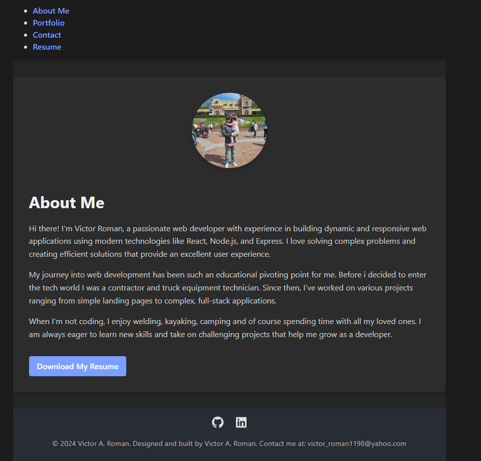

# My--Portfolio-2


## Description

This is my personal portfolio website showcasing my skills, projects, and experience. The website includes sections such as About Me, Portfolio, Contact, and Resume. It is built using React and deployed on Netlify.

## Demo

You can view the live demo of the application here: [Live Demo](https://rococo-hotteok-bea893.netlify.app/)



## Installation

To run this project locally, follow these steps:

1. Clone the repository:
    ```sh
    git clone https://github.com/Romantech91/My--portfolio-2.git
    ```
2. Navigate to the project directory:
    ```sh
    cd My--portfolio-2
    ```
3. Install the dependencies:
    ```sh
    npm install
    ```

## Usage

To start the development server, run:
    ```sh
    npm start
    ```

This will start the application on http://localhost:3000

## Features

 - Responsive Design: the website is fully responsive and works on all devices.
 - About Me Section: Information about my background and skills.
 - Portfolio Section: Showcase of my projects with descriptions and links.
 - Contact Section: A form to get in touch with me.
 - Resume Section: Downloadable resume and list of proficiencies.

## License

Distributed under the MIT License.

## Badges


## Questions

If you have any questions about the project, please feel free to contact me:

 - Github: [Romantech91](https://github.com/Romantech91)
 - Email: [victor_roman1198@yahoo.com](mailto:victor_roman1198@yahoo.com)